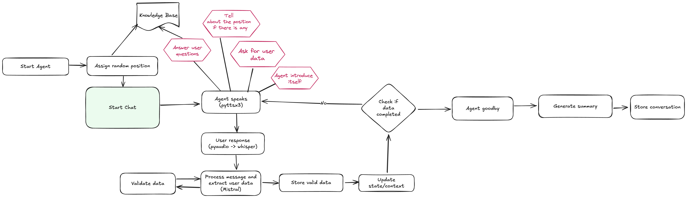

# HR Converational Agent
## Descripción
Se trata de un pequeño agente conversacional que se encarga de recoger algunos datos básicos de un candidato para su tratamiento por RRHH en una empresa ficticia dedicada a la fabricación de palas de padel.

El objetivo del agente es mantener una conversación de voz con el candidato en la recoger Nombre, Edad y Turno de trabajo preferido además de contestar alguna pregunta sobre la empresa si el cantidato la tuviera.

Una vez recogidos los datos se genera un json con la información estructurada, un log de la conversación y un resumen ejecutivo con puntos claves de la conversación y posibles acciones derivadas.

## Setup
Para instrucciones de instalación y confguración del proyecto consultar INSTALL.md

## Tecnologías utilizadas
Se ha priorizado el uso de tecnologías ligeras y con posibilidad de ejecución local por el propósito de la prueba.

### Grabación de audio
Se utiliza la librería pyaudio(https://pypi.org/project/PyAudio/) para grabar el audio del usuario.

Dado que esto no deja de ser una prueba de concepto en caso de no encontrar una interfaz de audio se ha implementado una grabación a través de la consola. Esto es principalmente para el caso de ejecutar el contenedor desde Docker ya que no tendrá acceso al hardware del host. 

### Reproducción de audio
Para la reproducción de audio se ha utilizado pyttsx3(https://pypi.org/project/pyttsx3/) que permite reproducir texto en voz.

Igual que en el caso de la grabación, en caso de no encontrar una interfaz de audio se ha implementado una reproducción a través de la consola. Una vez mas para el caso de Docker es especialmente útil.

### Transcripción de audio
Para la transcripción de audio se ha utilizado Whisper(https://github.com/openai/whisper) de OpenAI que permite transcribir audio a texto.

### RAG - Base de conocimientos
Para la base de conocimientos se ha utilizado un modelo preentrenado de Sentence Transformers(https://www.sbert.net/)(all-MiniLM-L6-v2). Con él se hace la ingesta de documentos con datos ficticioes de la empresa y hacemos búsquedas en ellos por coincidencias de contenido.

### LLM
Como LLM se ha utilizado Mistral. Ejecutado localmente con Ollama. Esto se utiliza para la conversación, la extracción de información y la generación de resumenes.

### Orquestración
Para la orquestación del agente se ha utilizado LangChain(https://www.langchain.com/). Con el se gestiona el contexto, la memoria y el flujo de la conversación.

## Asunciones y limitaciones
- Al usarse bastante el hardware local en su ejecución, tanto para los modelos llm como para la entrada y salida de audio es posible que se encuentren erroes al ejecutarse en sistemas diferentes.
He dearrollado el agente en un Macbook pro con chip M2. Y aunque ha sido dockerizado esta parte es problemática y no se ha invertido excesivo tiempo en buscar una solución ya que no disponía de otros equipos con diferentes arquitecturas o sistemas operativos y considero que queda fuera del alcance de la prueba.

- Los prompts y en general todo el agente está enfocado al uso en español. 

- La velocidad de respuesta es lenta. El modelo se está ejecutando en local y la velocidad está limitada por la potencia del hardware.

- Los prompts se podrían seguir mejorando. Hay todavía escenarios en los que puede alucinar en exceso y ser demasiado imaginativo. También es algo verboso.

- La fuente de información ha sido generada mediante IA y la búsqueda es algo limitada. No hay tanta información y la información en formato json tiene peor resultado a la hora de hacer preguntas.

- El código no está cubierto 100% por tests, se han hecho gran parte de los unitarios y alguno de integración, pero se asume que para un proyecto real se haría un testing más exhaustivo.

## Ejemplos
En la carpeta examples se encuentran ejemplos de conversaciones con el agente. Se trata del output que genera el agente con diferetes escenarios. Se han probado respuestas simpes, combinadas (dar varios datos a la vez), preguntas sobre la empresa, salidas tempranas de la conversación y datos erróneos.

## Estructura del proyecto
```
hr-agent/
├── src/
│   ├── agent/
│   │   ├── prompts/
│   │   │   ├── conversation_prompt.py  # Prompt principal para el LLM
│   │   │   ├── extraction_prompt.py    # Prompt para la extracción de información
│   │   │   └── summary_prompt.py       # Prompt para la generación del resumen
│   │   ├── conversation_manager.py     # Se encarga de gestionar la conversación, la memoria,
│   │   │                                 generar las respuestas y devolver el historial de la conversación
│   │   ├── extraction_chain.py         # Contiene la cadena de LangChain para la extracción de
│   │   │                                 información del input del usuario
│   │   ├── hr_agent.py                 # Lógica principal del agente. Recibe el input del usuario
│   │   │                                 y gestiona el flujo de la conversación
│   │   ├── position_manager.py         # Utiliza la bae de conocimiento para asignar (o no) un puesto al 
│   │   │                                 candidato y devolver detalles de la posición
│   │   ├── question_handler.py         # Utiliza la base de conocimiento para detectar y responder preguntas
│   │   ├── state_manager.py            # Gestiona el estado de la conversación, los datos guardados y validados del usuario
│   │   │                                 y la información faltante
│   │   └── validators.py               # Validaciones de datos
│   ├── audio/
│   │   ├── recorder.py                 # Grabación de audio
│   │   ├── speaker.py                  # Reproducción de audio
│   │   └── transcriber.py              # Transcripción de audio usando Whisper
│   │
│   ├── config/
│   │   └── settings.py                 # Configuraciones globales
│   │
│   └── main.py                         # Orquestador de la aplicación. Inicializa los componentes y ejecuta el flujo de la conversación
│
├── tests/
│   ├── integration/                    # Tests de integración
│   └── unit/                           # Tests unitarios
│
├── examples/                           # Ejemplos de conversaciones
│   ├── conversation_1.json
│   └── conversation_2.json
│
├── company_data/                       # JSONs y Markdowns para la ingesta de la base de conocimientos
├── Dockerfile                          # Configuración de Docker
├── requirements.txt                    # Dependencias del proyecto
├── requirements-docker.txt             # Dependencias específicas para Docker
└── run.py                              # Punto de entrada de la aplicación
```

### Piezas fundamentales
#### Conversation Manager
Gestiona la interacción con el LLM para generar respuestas y gestionar la memoria del agente para guardar contexto de lo que se ha hablado con el usuario

#### Extraction Chain
Se comunica con el LLM para extraer información del input del usuario y convertirla a un model con el que poder trabajar.

#### State Manager
Esta pieza se encarga de gestionar el estado de la conversación pero no en un sentido de memoria, sino de la información que se ha guardado del usuario. Para saber por donde dirigirla, si hay que terminarla o si hay que seguir recopilando datos. También añade contexto necesario para ayudar al LLM cuando hay errores de validación.

#### Question handler
Se encarga de detectar si el usuario tiene una pregunta sobre la empresa y se la responde con la información que hay en la base de conocimientos.

He decidido meter una pieza como esta para emular un escenario mas complejo con lógica de negocio intermedia.


#### Main.py
Orquestador de la aplicación. Inicializa los componentes y ejecuta el flujo de la conversación

### Flujo de la aplicación




## Próximos pasos
- Mejorar la velocidad de respuesta del LLM/usar modelos en cloud
- Mejorar la precisión de la extracción de información
- Mejorar la precisión de la búsqueda en la base de conocimientos
- Mejorar la precisión de la generación de resumenes
- Mejorar la precisión de la generación de respuestas
- Mejorar la precisión de la generación de respuestas
- Evitar que el LLM filtre parte del prompt al generar respuestas
- Mejor análisis de la conversación
- Aumentar la cobertura de tests
- Multilenguaje
- Detectar mejor pausas, silencios e interrupciones del usuario